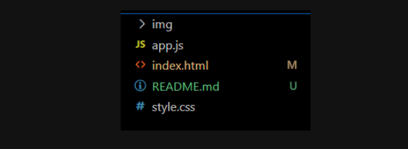
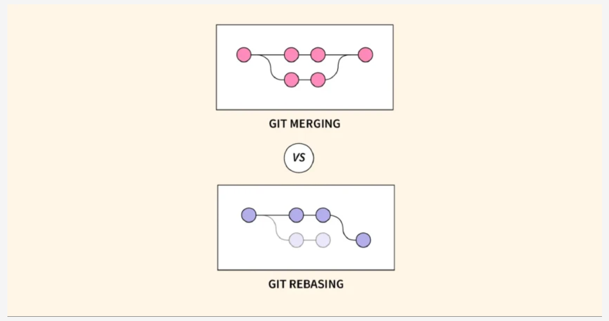

## Link para documentações

+ [Convertional commit: ](https://www.conventionalcommits.org/pt-br/v1.0.0-beta.4/)

<h1> Sistema de cadastro de jogos</h1>

> Status: em desemvolvimento
Para rodar esse projeto na sua máquina, por favor digite:

```
node app.js
```

# Comandos na branch

> `git checkout` -->  Alternar ramificações ou restaurar arquivos da árvore de trabalho

> `git checkout -b` --> Faz a criação de uma nova branch

> `git branch -a` --> lista todas as branchs tanto local quanto remoto

> `git branch` --> Lista as branchs

> `git switch` --> Faz a troca de branchs

# Para criar uma cópia da branch remota

> Basta Colocar um nome da branch local e apontar a origem com o link do repositório que deseja copiar

`git checkout -b <nome-do-seu-branch-local> origin/<nome-do-branch-remoto>`

# Para fazer o link entre a branch local e remota

`git remote add origin https://github.com/Felipewiiu/ApiContext.git`

# Para definir para qual branch se deve fazer o upload

`git push -u origin master`

## Sinalizações em arquivos do VSCode

Mas o que isso significa as letras M e U do vscode?



+ M: A letra M representa o estado Modified, do português modificado. Isso significa que o arquivo já existia no repositório, mas que recebeu alguma modificação que ainda não foi registrada no Git.

+ U: A letra U representa o estado Untracked, do português não rastreado. Isso significa que o arquivo ainda não existia no repositório e que ainda não teve seu registro (commit) feito no Git.

## Desfazendo um commit

Para que possamos desfazer alterações em nosso código basta usar o comando: 

````
git revert mais [id] do commit

````
esse comando funciona como um control + z em todas as alterações do arquivo e nos traz um novo commit.

## Apagando um commit

Para que possamos apagar um commit usamos o seguinte código:

````javascript
git reset --hard a3322db2eb6f82162977169f5461fc93b81bfac1

````

**OBS:** _PAra que esse comando funcione precisamos passar o ID do commit anterios._

## Comando para se alterar o nome de um commit

Para que possamos mudar o nome de um commit ou adicionarmos um novo arquivo usamos o seguinte código:

````
git commit --amend -m [novaMensagemColoqueAqui]

````
É importante destacar que os comandos do Git que permitem modificar o histórico de commits devem ser utilizados com prudência e apenas quando o commit em questão ainda não foi enviado ao repositório remoto, ou seja, quando ele existe apenas no seu repositório local.

Modificar um commit que já se tornou público, ou seja, aquele que já foi enviado ao GitHub ou a qualquer outro repositório remoto, pode acarretar problemas consideráveis na colaboração com as outras pessoas e na integridade do histórico de um projeto.

Em situações de colaboração em equipe, é essencial manter a integridade do histórico de commits, pois qualquer modificação em um commit que outras pessoas estejam trabalhando pode resultar em conflitos e dificuldades na colaboração.

É recomendável evitar a modificação excessiva do histórico de commits, uma vez que isso pode tornar o histórico confuso. O histórico deve ser uma representação precisa do progresso do projeto ao longo do tempo.


## Git reflog


O git reflog é uma ferramenta muito útil no Git que mantém um registro de referências de cabeças (heads), o que inclui mudanças nos ponteiros de branches e commits mesmo que não estejam mais visíveis no histórico normal de commits. Ele é útil em situações em que você acidentalmente removeu um branch ou redefiniu o HEAD para um commit anterior e precisa recuperar o estado anterior.

````
Comando: git reflog

````

## Alixeira do git

Imagine o cenário em que você apaga um commit tanto no local, quanto no remoto. A maneira de se recuperar esse commit é indo na "lixeira" do git. Lá fica as informações que um dia existiram na linha do tempo do git e é possível recupera-las com o comando:

````
Comando que mostra o commit: git show [hash_do_commit]

Comando que recupera o commit: git cherry-pick

````

## Gitbisect

O git bisect é uma ferramenta poderosa no Git usada para encontrar o commit que introduziu um determinado problema em um projeto. Essa ferramenta utiliza uma abordagem de busca binária para encontrar o commit culpado em um histórico de commits.
Ele funciona basicamente com a analogia, dividir para conquistar, onde ele vai separando a parte boa das partes ruins até encontar o bug.

Ele pode ser usado com os seguintes comandos:

1. Primeiro precisamos pegar o primeiro commit: ` git log --oneline | tail -n 1`
2. Usar o ``git bisect start``
3. Marcar o commit ruim com `git bisect bad`
4. Marcar o commit bom ` git bisect good f0ea950`
5. Podemos visualizar o que ele está fazendo ` git bisect visualize --oneline`
6. Terminar o processo `git bisect reset`

**Dica de funcionamento**

- *Se eu marcar um commit como `bad`, ele se tornará o primeiro da lista de commits*

## Git rebase

O rebase é uma operação no Git que permite mover ou combinar commits de uma ramificação para outra. Ele reescreve o histórico de commits, aplicando as alterações de um ramo em cima de outro. O rebase é uma alternativa ao merge, que combina as alterações de diferentes ramificações criando um novo commit de merge.



<span style="color: red;">
*Importante: esse recurso é para ser realizado localmente e não no github*
</span>


